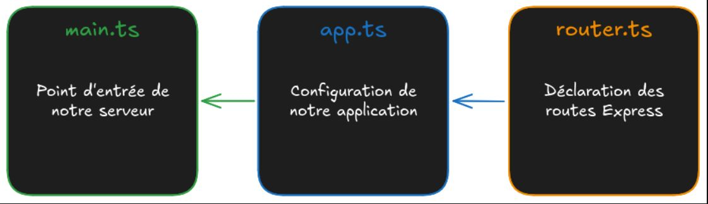
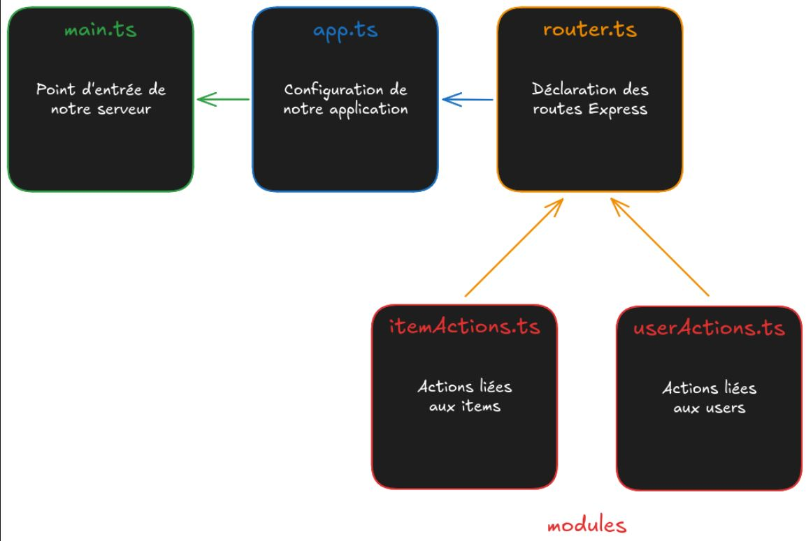

# JsMonoRepo

## Sommaire

- [main.ts](#maints)
- [Création d'un projet MonoRepo](#création-dun-projet-monorepo)
- [Lancement les applications cliente et serveur](#lancement-les-applications-cliente-et-serveur)
- [Lancement des applications cliente et serveur séparément](#lancement-des-applications-cliente-et-serveur-séparément)
- [Architecture simplifiée](#architecture-simplifiée)
- [router.ts](#routerts)
- [Les modules](#les-modules)
- [Création d'une nouvelle action](#création-dune-nouvelle-action)
- [query string](#query-string)
- [req.params](#reqparams)

---

### main.ts [^](#sommaire)

Le fichier `main.ts` du dossier `server/src` est le **point d'entrée du serveur**. C'est ce fichier qui, appel à toutes les composantes du projet pour créer, configurer et lancer l'application Express.

```javascript
// Load environment variables from .env file
import "dotenv/config";

// Check database connection
// Note: This is optional and can be removed if the database connection
// is not required when starting the application
import "../database/checkConnection";

// Import the Express application from ./app
import app from "./app";

// Get the port from the environment variables
const port = process.env.APP_PORT;

// Start the server and listen on the specified port
app
  .listen(port, () => {
    console.info(`Server is listening on port ${port}`);
  })
  .on("error", (err: Error) => {
    console.error("Error:", err.message);
  });
```

---

### Création d'un projet MonoRepo [^](#sommaire)

```bash
npm create @this-is-to-learn/js-monorepo@latest my-project
```

---

### Lancement les applications cliente et serveur [^](#sommaire)

Pour lancer les applications cliente et serveur en parallèle, utiliser la commande suivante :

```bash
npm run dev
```

Cette commande va **lancer** l'application *React* et l'application **Express** en **parallèle**, et permettre de travailler sur le développement **côté client** et **côté serveur** dans **un seul et même projet**.

### Lancement des applications cliente et serveur séparément [^](#sommaire)

Il est également possible de lancer les applications cliente et serveur séparément en utilisant les commandes suivantes :

```bash
npm run dev:client
npm run dev:server
```

---

### Architecture simplifiée [^](#sommaire)



- `main.ts` lance le serveur.
- `app.ts` configure l'application.
- `router.ts` déclare un ensemble de routes.

---

### router.ts [^](#sommaire)

```javascript
import express from "express";

const router = express.Router();

// Define Your API Routes Here

// Define item-related routes
import itemActions from "./modules/item/itemActions";

router.get("/api/items", itemActions.browse);
router.get("/api/items/:id", itemActions.read);
router.post("/api/items", itemActions.add);

export default router;
```

`Router` est une fonction du module `express` qui crée un l'objet **routeur**.

Un routeur est un objet qui permet de définir un ensemble de routes pour les utiliser sur une application Express.

---

### Les modules [^](#sommaire)

Le fichier `./modules/item/itemActions.ts` exporte un objet avec 3 **actions** (`browse`, `read` et `add`) affecté à la variable `itemActions`.

Cette variable est ensuite utilisée sur le routeur avec ces lignes :

```javascript
router.get("/api/items", itemActions.browse);
router.get("/api/items/:id", itemActions.read);
router.post("/api/items", itemActions.add);
```



### Création d'une nouvelle action [^](#sommaire)

Création d'un fichier `server/src/modules/say/sayActions.ts` :

```javascript
// Declare the action

import type { RequestHandler } from "express";

const sayWelcome: RequestHandler = (req, res) => {
  res.send("Welcome to Wild Series !");
};

// Export it to import it somewhere else

export default { sayWelcome };
```

Puis dans `server/src/router.ts`, ajouter la route :

```javascript
import express from "express";

const router = express.Router();

/* ************************************************************************* */
// Define Your API Routes Here
/* ************************************************************************* */

// Define item-related routes
import itemActions from "./modules/item/itemActions";

router.get("/api/items", itemActions.browse);
router.get("/api/items/:id", itemActions.read);
router.post("/api/items", itemActions.add);

// Declaration of a "Welcome" route

import sayActions from "./modules/say/sayActions";

router.get("/", sayActions.sayWelcome);

export default router;
```

### query string [^](#sommaire)

Une **chaîne de requête** (**query string** en anglais) est une partie d'une **URL** qui attribue des valeurs à des paramètres spécifiques.

Ces paramètres de requête sont en général situés après le chemin d'accès, séparés par un point d'interrogation **(?)**.

Pour réaliser une recherche, utiliser `req.query`. 
Exemple :

```javascript
const programs = [
  /* ... */
];

import type { RequestHandler } from "express";

const browse: RequestHandler = (req, res) => {
  if (req.query.q != null) {
    const filteredPrograms = programs.filter((program) =>
      program.synopsis.includes(req.query.q as string)
    );

    res.json(filteredPrograms);
  } else {
    res.json(programs);
  }
};

export default { browse };
```

Si `req.query.q` est défini (`!= null`), le code renverra la liste des séries dont le synopsis contient le texte demandé.

Pourquoi `q=` dans l'URL ? En soi, le paramètre peu être nommé comme ont le souhaite, tant que le code est cohérent : `req.query.toto` pour une URL contenant `toto=`.

### req.params [^](#sommaire)

[Retour au sommaire](#sommaire)
