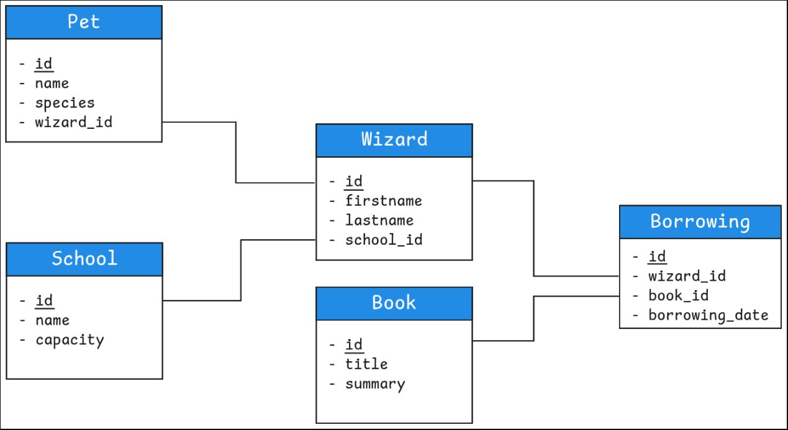

# MySQL | Les bases de la modélisation

## Sommaire

- [La méthode Merise](#la-méthode-merise)
- [MCD : le schéma entité / relation](#mcd--le-schéma-entité--relation)
	- [Les entités](#les-entités)
	- [Les relations](#les-relations)
	- [Les cardinalités](#les-cardinalités)
- [MLD : les tables et les champs](#mld--les-tables-et-les-champs)
	- [Les types de relations](#les-types-de-relations)
	- [Les clés étrangères](#les-clés-étrangères)

### La méthode Merise [^](#sommaire)

**Modéliser** une base de données dépend avant tout de la **compréhension** des **règles métiers**, c'est-à-dire des **besoins du client**.

**La méthodologie Merise** (datant des années 70) apporte des règles précises pour modéliser convenablement les données.

Nous ne présentons que **3 modèles** de la *méthode Merise* :

- **MCD :** Modèle Conceptuel de Données
- **MLD :** Modèle Logique de Données
- **MPD :** Modèle Physique de Données

### MCD : le schéma entité / relation [^](#sommaire)

Le schéma **entité/relation** permet, une fois transformé, de refléter la modélisation finale correspondant exactement aux tables et champs à créer en SQL.

#### Les entités [^](#sommaire)

La **modélisation** consiste à **regrouper** de manière logique des **données** (un élève, une école, un livre) dans des **entités**.

Chaque **entité** possède un certain nombre d’**attributs** qui lui sont propres (un nom et un prénom pour un élève ; un nom et une capacité pour une école ; un titre et un nombre de pages pour un livre, etc.).

Une **entité** doit également posséder un **identifiant unique** (correspondant à un ou plusieurs attributs) pour **caractériser sans ambiguïté** possible une instance de cette entité.

De **manière schématique**, les **entités** sont **représentées sous forme d’un carré**. Le **carré** contient en **haut le nom de la table**, et **en dessous** une liste des **attributs**.

#### Les relations [^](#sommaire)

Les **entités** d'un système sont **reliées** par des actions. Une **relation** représente cette action entre **au moins 2 entités**.

**Un exemple :**

Dans la bibliothèque de Poudlard, un sorcier peut lire un livre ou l'emprunter.

Dans cet exemple, **sorcier** et **livre** sont des entités.

**Lire** et **emprunter** sont des relations.

A noter que les entités sont des noms reliés par des verbes d'action :

- sorcier - lire - livre (un sorcier peut lire un ou des livres)
- sorcier - emprunter - livre (un sorcier peut emprunter un ou des livres)

La **relation** est symbolisée par un **cercle** contenant généralement un **verbe d’action** (ici borrow pour **emprunter**), éventuellement les champs propres à la relation, et un **trait** passant par le cercle **reliant les deux entités** :

#### Les cardinalités [^](#sommaire)

Les **cardinalités** décrivent le **nombre d'interactions possibles** entre un élément d’une entité et une autre entité.

**Exemple :**

**sorcier - lire - livre**

- un sorcier peut lire un ou des livres
- un livre peut être lu par un ou des sorciers

Réfléchir aux cardinalités, c'est se poser la question **combien ?** : un ou des ?

1. Un sorcier peut lire combien de livres ? Un livre ou des livres ?
2. Un livre peut être lu par combien de sorciers ? Un sorcier ou des sorciers ?

**Solution :**

1. Un sorcier peut lire plusieurs livres.
2. Un livre peut être lu par plusieurs sorciers.

**Autre exemple : L'inscription d'un sorcier dans une école de magie**

**sorcier - inscrire - école**

1. un sorcier peut être inscrit dans une ou des écoles
2. Dans une école peuvent être inscrits un ou des sorciers

**Qu'en penses-tu ?**

1. Un sorcier peut être inscrit dans combien d'écoles ? Une école ou des écoles ?
2. Dans une école peuvent s'inscrire combien de sorciers ? Un sorcier ou des sorciers ?

**Solution :**

1. Un sorcier peut être inscrit dans une seule école.
2. Dans une école peuvent s'inscrire plusieurs sorciers.

Toutes ces questions entraînent des modélisations qui peuvent être très différentes.

Après discussion avec notre client fictif, un sorcier peut être inscrit dans une seule école (maximum) ou ne pas être inscrit du tout (minimum). La cardinalité de la relation Wizard -> School est donc 0-1 : un Wizard peut être inscrit dans 0 School au minimum et 1 School au maximum.

Dans une école peuvent s'inscrire plusieurs sorciers (maximum) ou aucun sorcier du tout (minimum, imagine que l'école vient juste d'ouvrir et n'est pas encore affichée dans Parcoursup). La cardinalité de la relation School -> Wizard est donc 0-N : dans une School peuvent s'inscrire 0 Wizard au minimum et N Wizard au maximum (N signifie ici "plusieurs", un nombre indéfini supérieur à 1).

### MLD : les tables et les champs [^](#sommaire)

Comment passer de ce schéma avec des entités et des relations à des tables et des champs dans une base de données ? Pour cela, il faut procéder à quelques transformations.

**Pour les entités :**

- Chaque entité devient une **table**.
- Chaque **propriété** de l’entité devient un **champ** de la table.
- Les **identifiants** deviennent des **clés primaires**.

#### Les types de relations [^](#sommaire)

Comment relier les données d’une table avec celles d’une autre table ?

Considèrons un sorcier (un **tuple** de la table **wizard**, identifié par sa clé primaire id) scolarisé dans une école (un tuple de la table school, identifié par sa clé primaire, également appelée id).

Un élève ne peut être inscrit que dans 0 à 1 école à la fois..

La relation inverse school->wizard est quant à elle de type 0 à N : une école peut en effet accueillir de 0 à N élèves.

Maintenant que tu as les cardinalités de ta relation dans les deux sens, regarde les bornes maximales : le 1 de "0 à 1" et le N de "0 à N". Ce sont ces maximales qui nous intéressent pour la suite. Tu te retrouves donc avec une relation 1-N.

Tu peux obtenir trois combinaisons de valeurs maximales, donc trois types de relation :

**One To One (1-1) :** une relation unique entre deux entités. Par exemple, un Sorcier ne pourra posséder qu’un et un seul Familier, et un Familier n’appartient qu’à un seul et un seul Sorcier.

**One To Many (1-N) :** c’est le cas juste au-dessus où un Sorcier s'inscrit dans une seule École et où dans une École peuvent s'inscrire plusieurs Sorciers. Tu peux aussi parler de Many To One si tu le lis dans l'autre sens : c'est la même chose.

**Many To Many (N-N) :** une entité peut interagir avec plusieurs éléments d’une autre entité, et vice versa. Par exemple, un Sorcier peut emprunter plusieurs Livres, et un Livre peut être emprunté par plusieurs Sorciers.

#### Les clés étrangères [^](#sommaire)

Comment indiquer qu'une table est reliée à une autre table ?

**One To Many / Many To One**

Considèrons à nouveau l’exemple **One To Many** entre wizard et school.

Le 1 de la relation 1-N est côté wizard tandis que le N est côté school. Cette fois, le sens est très important : cela veut dire que côté wizard, une valeur est à stocker (l'id de son école) alors que côté school recquière une liste de valeur à stocker (la liste des ids de ses élèves).

Dans l'orthodoxie des bases de données, un champ doit stocker une seule valeur : ne jamais stocker plusieurs valeurs (une liste) dans un seul champ.

En suivant ce principe, c’est dans la table wizard qu'il faut ajouter un nouveau champ. Son but est de concrétiser le lien entre les deux tables.

Nommons ce champ: school_id. Pour chaque tuple, le but de ce champ sera de prendre la valeur de la clé primaire de la table school, identifiant l’école dans laquelle ce sorcier est inscrit.

Pour faciliter la lecture, indiquer les liens entre clés primaires/étrangères par des traits. Le **MCD** est devenu un **MLD** :

En règle générale, une **clé étrangère** fait référence à une **clé primaire** d’une autre table.

**Règle de base :** la clé primaire de l'entité côté N devient clé étrangère dans l'entité côté 1.

**Many To Many**

Retournons dans notre histoire de bibliohèque : un élève peut emprunter **plusieurs** livres, et un livre peut être emprunté par **plusieurs** élèves. Pas de "côté 1"...

Dans ce cas, tu ne peux ni mettre une clé `book_id` dans `wizard`, ni mettre une clé `wizard_id` dans `book`. Ni d'un côté, ni de l'autre : ta solution est au milieu. Tu dois créer une **nouvelle table intermédiaire** qui va contenir les deux clés étrangères.

Par convention, une table intermédiaire (aussi table de jointure) est nommé d'après les noms des tables jointes, dans l'ordre alphabétique. Pour `Wizard` et `Book`, cela donnerait `Book_Wizard`. Tu peux aussi donner un "vrai" nom si tu en as un évident. Plutôt que `Book_Wizard`, la table pourrait s’appeler par exemple `Borrowing` (emprunt).

Selon les cas, la clé primaire pourra être composite, c’est-à-dire définie par le couple de clés étrangères `wizard_id` ET `book_id`. Dans cet exemple, un même sorcier peut emprunter un même livre à différentes dates. Dans ce cas, il faudrait plutôt créer une clé primaire auto-incrémentée pour s’assurer de l’unicité de la clé. Si besoin, cette table intermédiaire peut également accueillir des champs supplémentaires (par exemple une date de retour) qui ne seraient à leur place ni dans la table `wizard`, ni dans la table `book`.

Ces différentes règles permettent de transformer un **MCD** en un **MLD** :

[Retour au sommaire](#sommaire)