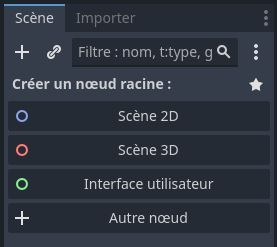

# GODOT | Ressource

## Sommaire

- [Ressources](#ressources)
  - [GODOT](#godot)
  - [GDQuest-demos](#gdquest-demos)
- [Création d'un nouveau projet](#création-dun-nouveau-projet)
- [Interface](#interface)
  - [Mode](#mode)
  - [Actions](#actions)
- [Naviguer dans une scène (raccourcis clavier à connaître)](#naviguer-dans-une-scène-raccourcis-clavier-à-connaître)

### Ressources [^](#sommaire)

#### GODOT [^](#sommaire)

**Site officiel :**

- [GodotEngine](https://godotengine.org/) : Installation

Installation de la version prenant en charge `C#` :

- `Godot Engine - .NET`

Pré-requis à l'installation de cette version :

- Intallation de `.NET SDK`.

#### GDQuest-demos [^](#sommaire)

Ressource open-source de projets GODOT en libre téléchargement sur Github.

**Lien :**

- [GDQuest-demos](https://github.com/gdquest-demos)

### Création d'un nouveau projet [^](#sommaire)

1. Double-cliquez sur l'exécutable
2. Cliquez sur **Nouveau projet** dans la fenêtre **Gestionnaire de projets**
3. Nommez un nom de projet dans la fenêtre **Créer un nouveau projet**
4. Indiquez le chemin du projet
5. Il est possible de créer un dossier à partir de cet fenêtre
6. Une option permet de versionner le projet avec Git
7. Cliquez sur **Créer et ouvrir**
8. Le projet s'ouvre dans Godot

---

### Interface [^](#sommaire)

### Mode [^](#sommaire)

- `2D` basculer en mode 2D
- `3D` basculer en mode 3D
- `Script` permet d'écrire des scripts directement dans une interface dédiée
- `AssetLib` bibliothèque d'outils et de ressources open-source

---

### Actions [^](#sommaire)

---

Lancement du projet (F5).

---
Lancement du scène actuelle (F6).
 

---

Zone de travail.

---

Panneau `Scène` : Tout ce qui a été créé sera présenté sous forme d'arborescence dans ce panneau.

---

`Système de fichiers` : Tout ce qui est importé dans le projet apparaît dans ce panneau.

---

`Inspecteur` : Permet de caractériser les objets.

---

### Naviguer dans une scène (raccourcis clavier à connaître) [^](#sommaire)

- Ajouter un noeud : `ctrl + a`.
- `F` centrer la vue sur un objet.
- `click-droit` rotation de la tête.
- `maintenir molette` rotation autour de l'origine du monde.
- `shift + maintenir molette` mouvement latéraux.
- `ctrl + maintenir molette` zoom.
- `ctrl + d` dupliquer un objet après l'avoir sélectionné.
- `5` basculer entre les modes orthographique et perspective.
[Retour au sommaire](#sommaire)
